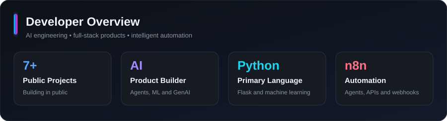
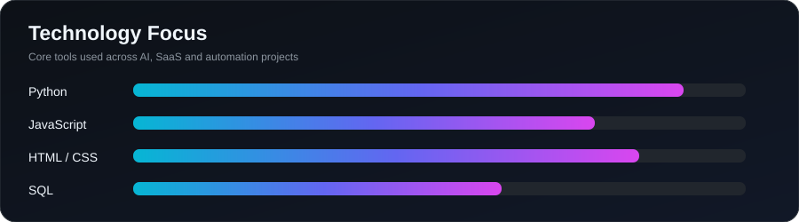
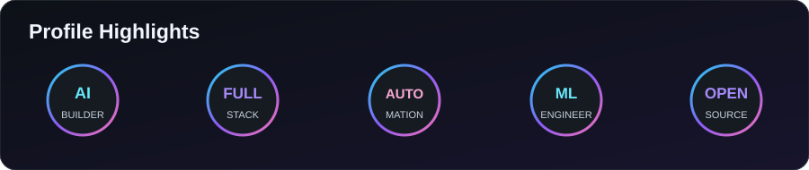

<div align="center">

# Galla Jagadeesh

[](https://github.com/DenverCoder1/readme-typing-svg)

### AI & Full Stack Developer · Prompt Engineer · n8n Automation Developer

I build practical AI-powered products, intelligent automations, and modern full-stack applications that turn real-world ideas into useful software.

[](https://github.com/gallajagadeesh17)
[](https://github.com/gallajagadeesh17?tab=followers)

</div>

---

## About Me

- AI & Full Stack Developer focused on building production-minded applications.
- Prompt Engineer creating reliable instructions and structured AI workflows.
- n8n Automation Developer integrating APIs, webhooks, Gmail, Gemini, and business processes.
- Currently building AI-powered SaaS applications and intelligent developer tools.
- Interested in Agentic AI, Generative AI, Multi-Agent Systems, Automation, and Full Stack Development.
- B.Tech Computer Science student specializing in Artificial Intelligence.

**Core keywords:** AI Developer · Full Stack Developer · Python Developer · Flask Developer · React Developer · Machine Learning · Generative AI · Agentic AI · Prompt Engineering · n8n Automation · SaaS Developer

---

## Tech Stack

### Languages


### Frameworks


### AI & Machine Learning


### Automation & APIs


### Database & Tools


---

## Featured Projects

| Saarthi AI | AI Interview Assistant |
|---|---|
| **AI-powered Sales Intelligence Platform** that automates company research and produces contextual pre-meeting briefings for sales teams.<br><br>**Stack:** Flask, n8n, Gemini, Google Calendar API, GNews API, HTML, CSS, JavaScript<br><br>**Features:** Company intelligence, latest news, risk signals, talking points, meeting preparation, role-based dashboards<br><br>[Repository](https://github.com/gallajagadeesh17/Saarthi-AI) · **Live demo: Coming soon** | **AI interview preparation platform** with personalized practice, structured feedback, and progress tracking.<br><br>**Stack:** Python, Flask, Gemini, Gmail, SQLite, HTML, CSS, JavaScript<br><br>**Features:** Authentication, Gmail integration, interview history, reports, AI evaluation and feedback<br><br>**Repository: Coming soon** · **Live demo: Coming soon** |

<!-- TODO: Replace "Repository: Coming soon" above with the AI Interview Assistant repository URL. -->
<!-- TODO: Replace Saarthi AI and AI Interview Assistant "Live demo: Coming soon" text when deployed URLs are available. -->

| SpamGuard AI | MoodFlix |
|---|---|
| **Machine Learning spam-detection system** that classifies messages through a simple Flask interface.<br><br>**Stack:** Python, Flask, Scikit-Learn, Pandas, NumPy, TF-IDF, NLP<br><br>**Features:** Text preprocessing, TF-IDF vectorization, trained classifier, real-time prediction, responsive UI<br><br>[Repository](https://github.com/gallajagadeesh17/Spam-Detector) · **Live demo: Coming soon** | **Mood-based movie recommendation system** that helps users discover films based on how they feel.<br><br>**Stack:** Python, recommendation logic, HTML, CSS, JavaScript<br><br>**Features:** Mood selection, curated recommendations, lightweight interface, responsive experience<br><br>[Repository](https://github.com/gallajagadeesh17/MoodFlix-AI) · **Live demo: Coming soon** |

<!-- TODO: Replace SpamGuard AI and MoodFlix "Live demo: Coming soon" text when deployed URLs are available. -->

---

## GitHub Statistics

<div align="center">









</div>

---

## Achievements & Strengths


---

## Currently Working On

```text
Agentic AI             ███████████████████░
Multi-Agent Systems    ██████████████████░░
AI SaaS Applications   █████████████████░░░
Automation Workflows   ███████████████████░
Full Stack Projects    ████████████████░░░░
```

---

## Connect With Me

[](https://www.linkedin.com/in/galla-jagadeesh-001310298)
[](https://github.com/gallajagadeesh17)
[](https://github.com/gallajagadeesh17/portfolio)
[](mailto:jagadeesh.galla20@gmail.com)

<!-- TODO: Replace the Portfolio repository URL above with your deployed portfolio URL when available. -->
<!-- LinkedIn, GitHub, and email links are already filled with verified profile information. -->

---

## Developer Corner

<div align="center">


### Contribution Snake


</div>

---

<div align="center">

### Thanks for visiting

I am open to internships, collaborations, and opportunities involving AI, Python, Flask, React, Machine Learning, Generative AI, Agentic AI, Prompt Engineering, n8n Automation, and SaaS development.


</div>
